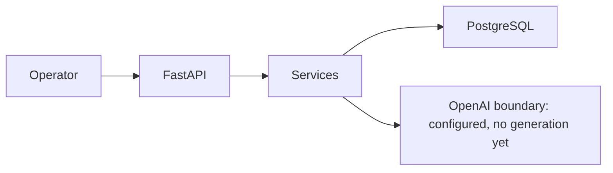

# Architecture

Takaven Go is a Python 3.12 FastAPI modular monolith with server-rendered Jinja HTML, HTMX, minimal Alpine.js, Tailwind CSS, SQLAlchemy, Alembic, and PostgreSQL.

Authentication is a single server-side session backed by `operator_sessions`. CSRF, strict cookies, CSP and security headers protect forms. Product Truth approved versions are immutable in application and PostgreSQL.

Current key entities are Product, TruthVersion, Signal, CreativeRun, CreativeRunSignal, Concept, Challenge, Experiment, Learning, AuditEvent, OperatorSession, and AIExecution. AIExecution stores bounded traceability only: state, provider/model, prompt/schema versions, source reference, idempotency key, request/error/result metadata.

OpenAI is the sole configured provider. API keys are server-side environment configuration and no AI action runs in the background.
