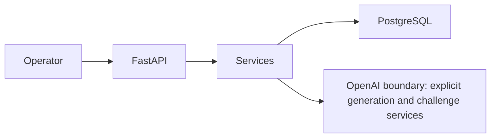

# Architecture

Takaven Go is a Python 3.12 FastAPI modular monolith with server-rendered Jinja HTML, HTMX, minimal Alpine.js, Tailwind CSS, SQLAlchemy, Alembic, and PostgreSQL.

Authentication is a single server-side session backed by `operator_sessions`. CSRF, strict cookies, CSP and security headers protect forms. Product Truth approved versions are immutable in application and PostgreSQL.

Current key entities are Product, TruthVersion, Signal, CreativeRun, CreativeRunSignal, Concept, Challenge, Experiment, Learning, AuditEvent, OperatorSession, and AIExecution. AIExecution stores bounded traceability only: state, provider/model, prompt/schema versions, source reference, request idempotency, optional concept-snapshot fingerprint, exact input, and request/error/result metadata.

OpenAI is the sole configured provider. API keys are server-side environment configuration and no AI action runs in the background. Stage 3B implements and accepts an explicit Generate-12 route, structured persistence and provenance, a single bounded structural repair attempt, and operator-controlled shortlisting. Deterministic PostgreSQL/UI verification and controlled real-provider `3b-v2` quality validation passed. System instructions are separated from deterministic JSON evidence; Signals and Learnings are untrusted data, not control instructions. This is layered resistance, not a claim that prompt injection is solved. Stage 3C implementation has started, but Stage 3C overall is not accepted or PASS.

Stage 3C design is frozen. Slice 1 is accepted as a UI-independent `challenge_concept` service for one shortlisted concept. Canonical JSON of the eight concept fields plus sorted claim warnings produces a SHA-256 `input_fingerprint`. A separate partial unique index permits one pending/running/succeeded challenge per unchanged snapshot while allowing retry after failure and a new slot after an operator edit. The initial challenge excludes manual judgment, freezes same-product approved Learnings in a deterministic null-first `approved_at`, then `id` order, validates model evidence references against the supplied input, and stores advisory output only in `AIExecution`.

Slice 2 is implemented and under review. The authenticated, CSRF-protected challenge workspace invokes that service explicitly, selects execution state by the current concept fingerprint, renders prior-fingerprint success as read-only history, and keeps the existing manual challenge authoritative and unprefilled. The route blocks a second initial challenge after any successful assessment; explicit revision/rechallenge remains Slice 3 and has not started. No background execution or schema change was added. The Stage 3C real-provider quality gate has not run, and Stage 3C overall is not PASS / accepted.
